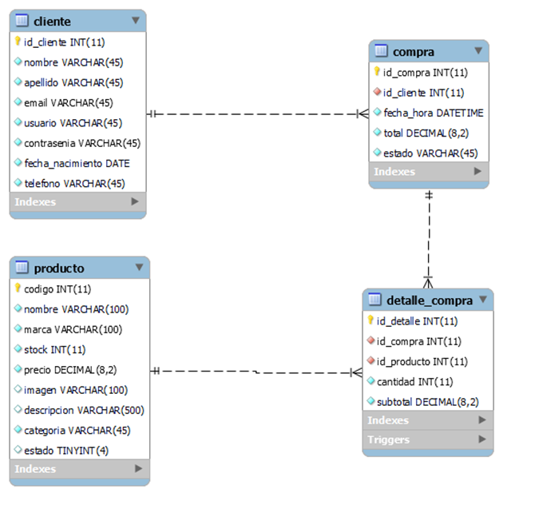

# Ferretería

Este proyecto, fue realizado con el propósito de finalizar el curso de Desarrollo Web Full Stack.  Acompañe a ver el recorrido que realicé para poder desde 0 construir este proyecto. 💫

## Tecnologías

- PHP, Laravel.
- HTML, CSS y Bootstrap

### ⚠️ A tener en cuenta

- ⏳ Tiempo para realizar el proyecto: 1 mes.
- 🧾 Experiencia sobre estas tecnologías antes de comenzar el proyecto: Ninguna.
- 📵 Por el momento no es responsive
- 💈  Fallos en css sobre formularios..

# Solución 
[GitHub - MendiburuFrancisco/ferreteria](https://github.com/MendiburuFrancisco/ferreteria)

# Problema

Para situarnos mejor y entender el contexto del problema, se realizó una pequeña historia que nos permite comprender mejor cuáles son las necesidades de nuestro cliente y encontrar los requerimientos necesarios:

**Una persona está remodelando su casa, pero se da cuenta que le hacen falta herramientas para poder terminar con la misma. Sin embargo, cuenta con muy poco tiempo para ir hacia la ferretería para seleccionar los productos. Prefiere hacerlo desde su casa y retirarlos cuando pueda.** 

### Actores Detectados

¿Qué deberían poder hacer los actores?

Cliente

- Registrarse
- Cambiar datos del usuario
- Realizar pedidos
- Cancelar pedidos
- Ver historial de pedidos
- Ver dónde poder retirar los pedidos realizados

Administrador

- Agregar nuevos productos, modificar y dar de baja
- Crear pedidos
- Modificar pedidos
- Cancelar pedidos
- Ver pedidos pendientes

### Cómo almacenar información

Una vez detectados los actores, debíamos empezar a encontrar la forma de almacenar información, y para ello buscamos un recibo y lo usamos como referencia. 

 
A partir de eso, pudimos realizar la base de datos y luego de varios intentos, quedó de la siguiente manera. 

### Base de datos

# Diseño UI

Debido al poco tiempo disponible, no pude reallizar un caso de estudio completo para mejorar la UX.  Sin embargo, comencé realizando los wireframes de alto nivel basándome en MercadoLibre y otras páginas dedicadas al mismo rubro.

Nota: No todos los wireframes para cada una de las pantallas fueron realizados.         
